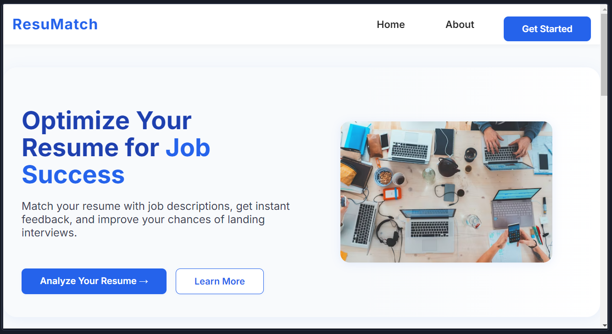
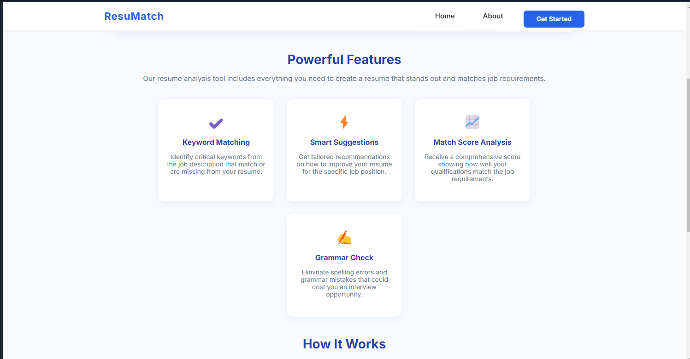
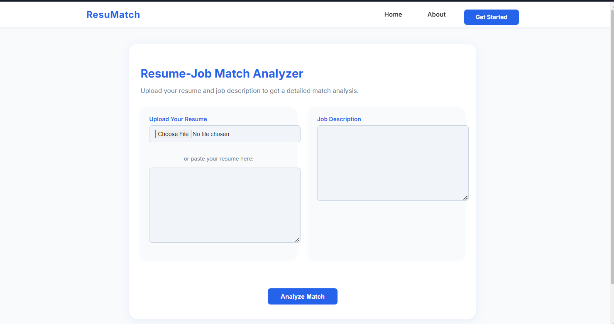
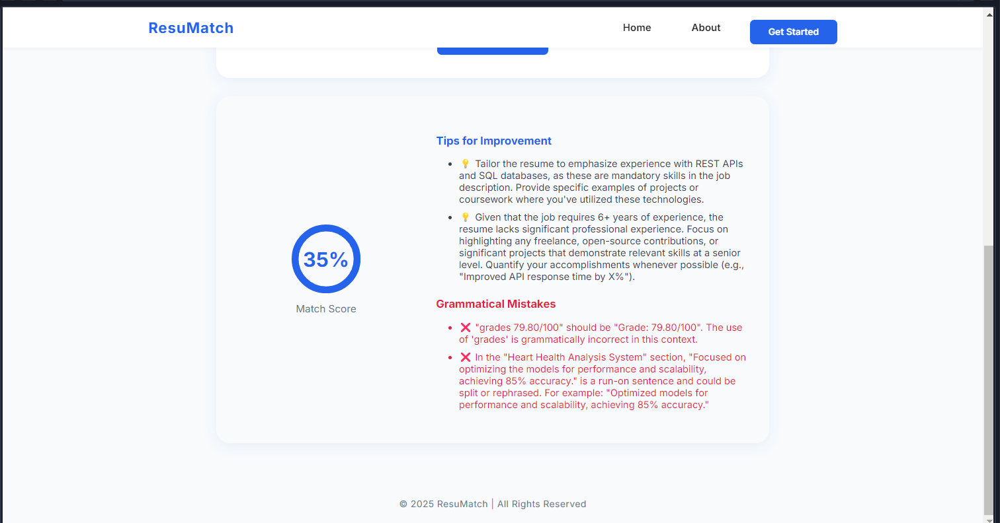

# ResuMatch

**ResuMatch** is an AI-powered resume-job matching platform that leverages generative AI (GenAI) to help job seekers optimize their resumes for specific job descriptions. Built with Django full stack development, ResuMatch provides actionable insights, smart suggestions, and a comprehensive match analysis to boost your chances of landing interviews.

[Live Demo](https://resumatch-0iad.onrender.com) | [GitHub Repository](https://github.com/Siddharth-Singh-Verma/ResuMatch)

---

## Table of Contents
- [Overview](#overview)
- [Features](#features)
- [How It Works](#how-it-works)
- [Approach](#approach)
- [Screenshots](#screenshots)
- [Getting Started](#getting-started)


---

## Overview
ResuMatch addresses the challenge of efficiently matching resumes to job descriptions by systematically exploring and integrating:
- **Rule-Based Techniques:** Exact keyword and skill matching.
- **Traditional Machine Learning:** Models like Logistic Regression, Random Forest, and XGBoost for improved accuracy.
- **Deep Learning & GenAI:** Advanced NLP models (BERT, GPT) and generative AI for nuanced analysis and suggestions.

The platform evaluates these approaches to determine the most effective method for automated hiring systems, ultimately delivering a GenAI-powered solution for job-resume compatibility.

## Features
- ✔️ **Keyword Matching:** Identify critical keywords from the job description that match or are missing from your resume.
- ⚡ **Smart Suggestions:** Get tailored recommendations to improve your resume for specific job positions.
- 📈 **Match Score Analysis:** Receive a comprehensive score showing how well your qualifications align with job requirements.
- ✍️ **Grammar Check:** Eliminate spelling and grammar mistakes that could cost you an interview.
- 📊 **Detailed Results:** Visual match score, improvement tips, and error highlights.

## How It Works
1. **Upload Your Resume:** Upload a PDF or paste your resume text.
2. **Add Job Description:** Paste the job description you're interested in.
3. **Analyze Match:** The AI compares your resume against the job requirements.
4. **Get Results:** Receive a match percentage, actionable tips, and grammar corrections.

## Approach
This project began with rule-based matching, progressed through traditional ML models, and culminated in a GenAI-powered solution. The GenAI approach leverages advanced NLP to:
- Compare resume and job description content semantically
- Provide a match percentage
- Suggest improvements
- Detect grammatical errors

## Screenshots
Website screenshots are available in the [`images/`](images/) folder:





- Example match analysis and suggestions

## Getting Started
### Prerequisites
- Python 3.8+
- pip
- (Optional) [virtualenv](https://virtualenv.pypa.io/)

### Installation
1. **Clone the repository:**
```bash
git clone https://github.com/Siddharth-Singh-Verma/ResuMatch.git
cd ResuMatch
```
